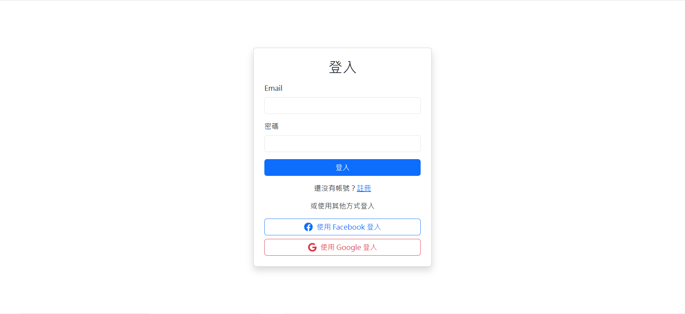
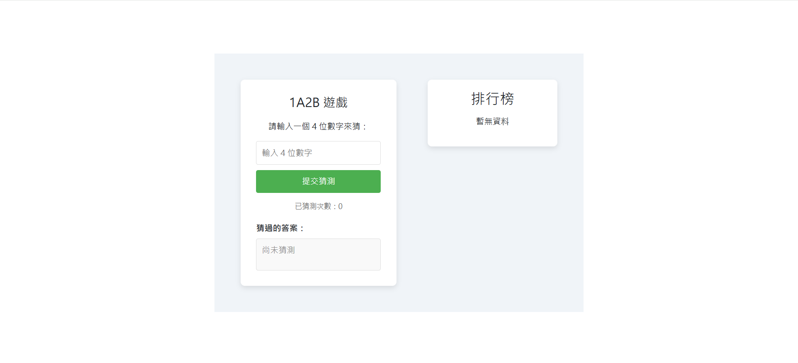
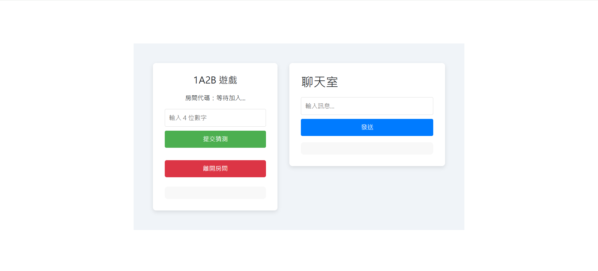

# 1A2B Game

A real-time web-based 1A2B (Bulls and Cows) game with both single-player and online two-player modes. Built with React and Golang. Includes real-time chat and turn-based guessing logic in multiplayer.

## Tech Stack

- Frontend: React (Vite)
- Backend: Golang
- Realtime Communication: WebSocket
- Authentication: MongoDB
- Game Data Storage: MySQL
- Backend Containerization: Docker, Docker Compose

## Features

- Single-player mode: Guess the number generated by the server
- Online two-player mode: Real-time match with another user
- Turn-based guessing system
- In-game chat during multiplayer matches
- User login and signup (MongoDB)
- Game history stored in MySQL
- Backend containerized using Docker

## Screenshots

  
  


## Getting Started

```bash
# Start Frontend
cd frontend
npm install
npm run dev

# Start Backend
cd ../backend
docker-compose up --build


```
<<<<<<< HEAD
=======

>>>>>>> f39a2e2615b76fc71ca00ff9e80ee239f93bfd9c
